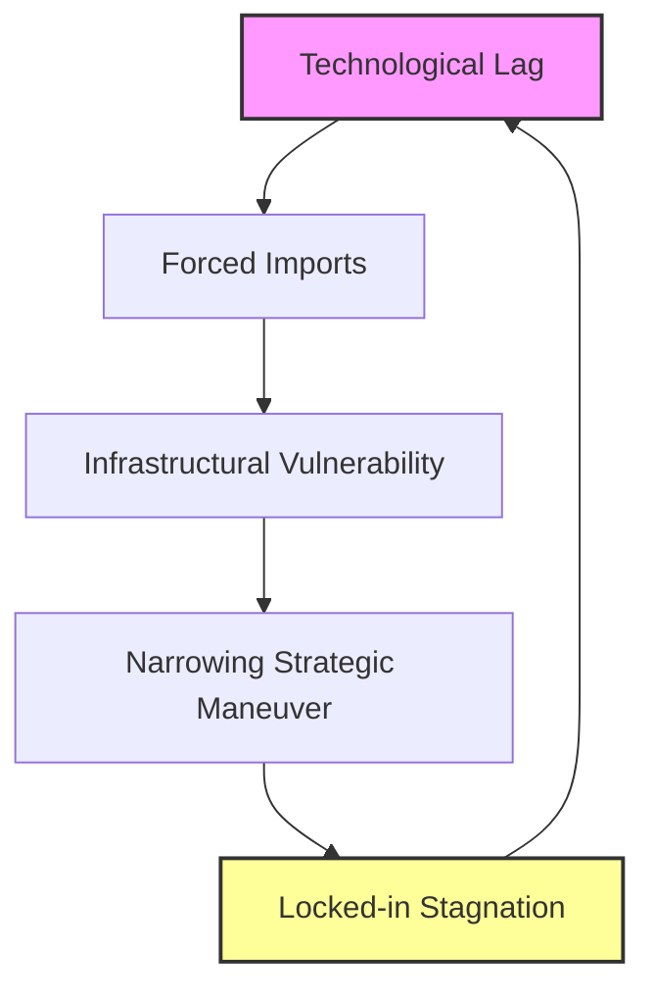

# The Sovereignty Degradation Loop and New Connectivity Axes: Where the VSCI Index Leads in 2026

The modern world has definitively entered the era of **Technological Westphalia**, where traditional state borders are giving way to digital and infrastructural contours. The **VSCI (Vivien Yor Sovereignty & Connectivity Index)**, which tracks the asymmetries of digital sovereignty, currently points to critical fractures developing across the Global South and Eurasia. Today, technological dependence is no longer a secondary factor in development—it has become the primary mechanism for redistributing global power.

---

### Latin America as a Leading Indicator

The processes unfolding in Latin America serve as a leading indicator for the rest of the world. The region was the first to experience total infrastructural expansion without explicit, hard political coercion. 

On one hand, Chinese investment packages through forums like CELAC provide Latin American nations with liquidity and access to green technologies. On the other hand, US platforms maintain a strict monopoly over data management and the cognitive frameworks of society.

Latin America clearly demonstrates how illusory multi-vector diplomacy turns into a loss of agency. Countries in the region try to balance between Beijing's financial flows and Washington's technological standards. As a result, they lose the capacity to shape their own developmental agendas, turning into testing grounds for external scenarios.

---

### The Sovereignty Degradation Loop: The Global South and Russia

For the countries of the Global South and Russia, the VSCI index detects the activation of the **Sovereignty Degradation Loop**. This is a closed-loop trap that unfolds through the following stages:

1. **Technological Lag:** A total absence of a sovereign hardware component base and critical computing infrastructure (primarily next-generation AI architectures).
2. **Forced Imports:** The absolute necessity to buy or parallel-import foreign platform solutions, cloud services, and microchips.
3. **Infrastructural Vulnerability:** Migrating critical systems of public administration and national economies onto externally dependent architectures.
4. **Narrowing Strategic Maneuver:** The loss of ability to make independent, long-term economic choices due to constant threats of sanctions or sudden disconnection.
5. **Locked-in Stagnation:** National resources are entirely spent on maintaining the lifecycle of legacy foreign systems rather than funding breakthrough domestic R&D.

For Russia, this challenge is existential. Domestic import substitution efforts inevitably hit a wall: the lack of massive computing power, which is strictly rationed by global superpowers. Without breaking out of this loop, the sovereignty trap will tighten, reducing the country to a technological periphery despite any external political rhetoric.

---

### New Connectivity Axes: The KSA — Turkey — Pakistan Alliance

In response to the heavy pressure exerted by the [[три_мира_ии|Three Worlds of AI]], alternative centers of power are emerging on the global stage. The most notable macro-regional alliance is the **Kingdom of Saudi Arabia (KSA) — Turkey — Pakistan** axis.

This triumvirate pools together highly unique complementary resources:
* **Saudi Arabia** provides abundant financial capital and the ambition to become the premier AI hub of the Middle East.
* **Turkey** acts as a crucial logistics node, a military-industrial driver, and a skilled technology integrator.
* **Pakistan** brings immense demographic potential, nuclear status, and a deep, fundamental engineering school tradition.

This alliance is trying to forge its own security and technological connectivity perimeter, independent of both Washington and Beijing. Their success or failure will show whether middle-tier powers can successfully defend their digital sovereignty via networked cooperation, or if they are bound to be absorbed by larger ecosystems.

---

### The Trans-Caspian Corridor and the Digital Geography of EU — China

Parallel to the physical shifts in global trade routes, a profound transformation is altering digital geography. The **Trans-Caspian Corridor** (The Middle Corridor), which connects the EU and China while bypassing Russia, is turning into a vital artery—not just for cargo, but for data.

The European Union, through initiatives like *Global Gateway*, is actively investing in the infrastructure of this macro-region. However, China is outpacing European institutions. Along with physical roads, Beijing is laying its own fiber-optic cables, building data centers, and implementing smart city standards. The Trans-Caspian Corridor is rapidly transforming into a space of hybrid control, where European regulatory frameworks clash directly with Chinese hardware dominance.

---

### Conclusion

An analysis of the [[индекс_vsci|VSCI Index]] in 2026 confirms the core dogma of **technorealism**: sovereignty in the 21st century is measured not by territorial size or army headcount, but by the density and independence of the technological networks a state controls. A nation must either find the strength to break the sovereignty degradation loop through extreme, focused efforts in fundamental science and infrastructure, or it will inevitably become mere digital substrate for the geopolitical projects of others.

---
**See also:**
* [[технореализм|Introduction to Technorealism]]
* [[три_мира_ии|The Three Worlds of AI Architecture]]
