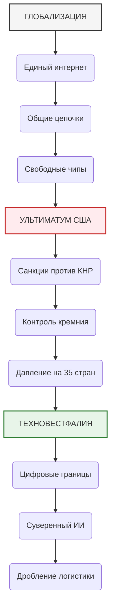
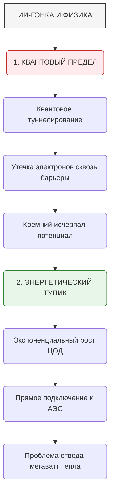
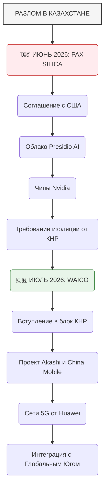

# ТЕХНОЛОГИЧЕСКАЯ ВЕСТФАЛИЯ: РАЗДЕЛ МИРА МЕЖДУ PAX SILICA И КИТАЙСКИМ СИМБИОЗОМ

## 1. СМЕРТЬ ГЛОБАЛЬНОГО ИНТЕРНЕТА: РОЖДЕНИЕ НОВОГО МИРОПОРЯДКА

Мир единых технологий, общего интернета и глобальных цепочек поставок официально мертв. На его руинах рождается новая epoch — **Технологическая Вестфалия**.

Этот термин отсылает нас к 1648 году. Тогда Вестфальский мир положил конец Тридцатилетней войне и закрепил понятие государственного суверенитета. Каждая страна получила право сама выбирать религию для своего народа по принципу: *«Чья земля, того и вера»*.

В 2026 году этот принцип звучит иначе: **«Чья земля, того и вычислительная архитектура»**.

Больше нет нейтрального цифрового пространства. Мировая техносфера раскололась на два гигантских, изолированных друг от друга военно-технологических блока:

* **Pax Silica (США и союзники)**. Технологическая империя закрытого типа. Она опирается на жесткий экспортный контроль, монополию на сложнейшее оборудование и сеть «атомных» дата-центров.
* **Китайский симбиоз / WAICO (КНР и Глобальный Юг)**. Распределенная экосистема, которая берет масштабом. Она предлагает миру открытый код, дешевую инфраструктуру и контроль над сырьевой базой планеты.

Это не просто соревнование экономик. Это фундаментальное столкновение двух разных подходов к физике, инженерии и управлению человечеством через искусственный интеллект. В этой статье мы проведем подробный аналитический разбор этого противостояния с позиции **технореализма** — подхода, который отбрасывает политическую риторику и смотрит исключительно на физические ограничения, баланс ресурсов и финансовые потоки.

---

## 2. АНАТОМИЯ БЛОКОВ: ФИЗИЧЕСКИЙ И ТЕХНОЛОГИЧЕСКИЙ БАЛАНС СИЛ

Чтобы понять логику новой холодной войны, необходимо изучить устройство и ресурсы обоих лагерей. Каждый из них обладает уникальными преимуществами и критическими уязвимостями.

### 🇺🇸 Блок Pax Silica: Цифровая крепость Запада
Американская стратегия строится на удержании технологического отрыва за счет жесткого контроля над «узкими горлышками» производства.

* **Контроль над литографией**. Главная опора блока — голландская компания ASML. Она обладает абсолютной монополией на производство сканеров экстремального ультрафиолета (EUV). Без этих машин физически невозможно напечатать транзисторы размером менее 5 нанометров. США заперли эту технологию внутри своего контура.
* **Архитектурное превосходство**. Проектирование самых мощных ИИ-ускорителей (Nvidia, AMD, Google TPU) полностью сосредоточено в США.
* **Производственный альянс**. Pax Silica включает в себя Тайвань (TSMC), Южную Корею (Samsung) и Японию (поставщики химикатов). Это позволяет американцам контролировать всю цепочку создания чипа от чертежа до готовой кремниевой пластины.
* **⚠️ Слабое место**. Полная зависимость от импорта очищенного сырья и критическая нехватка базовых мощностей для быстрой химической сепарации металлов на территории США и ЕС.

### 🇨🇳 Китайский симбиоз (WAICO): Инфраструктурная паутина Глобального Юга
Пекин ответил на американскую блокаду созданием Всемирной организации сотрудничества в области ИИ (WAICO). Ее философия — технологическое равенство для стран, которые Запад оставил за бортом прогресса.

* **Сырьевой щит**. Китай контролирует до 90% мирового рынка очистки галлия, германия, графита и редкоземельных элементов. Без них невозможно построить ни один современный радар, лазер или полупроводниковую фабрику. Китай превратил таблицу Менделеева в свое главное оружие.
* **Масштабирование и открытый код**. Не имея доступа к американским чипам последнего поколения, Китай пошел по пути оптимизации софта. Архитектуры ИИ с открытым кодом бесплатно передаются партнерам по Глобальному Югу (Пакистан, Индонезия, страны Африки). Пекин предлагает не «купить продукт», а «построить совместную систему».
* **Производственная автономность**. Китай стремительно развивает собственную литографию (компания SMEE) и заводы SMIC. Пусть эти чипы толще (7-нм и 14-нм), но КНР способна производить их в колоссальных масштабах, полностью закрывая потребности промышленности и ВПК.
* **⚠️ Слабое место**. Физический отрыв от сверхпередовых вычислений (1-2 нанометра), который затрудняет создание ИИ общего уровня (AGI) в краткосрочной перспективе.

---

## 3. ФИЗИКА ПРОТИВ СВЕРХДЕРЖАВ: ПРЕДЕЛ КРЕМНИЯ, ЭЛЕМЕНТЫ И ЭНЕРГЕТИЧЕСКИЙ КРИЗИС

Технореализм требует признать: геополитика вторична по отношению к законам физики и химии. Именно на молекулярном и квантовом уровнях сейчас решается исход противостояния.

### Квантовый предел кремния
Современные транзисторы уменьшились до размеров нескольких атомов. На этом уровне кремний перестает подчиняться законам классической физики. Электроны начинают самопроизвольно перепрыгивать через изоляционные барьеры. Это явление называется **квантовым туннелированием**.

Чтобы заставить чипы работать быстрее, Pax Silica вынуждена внедрять новые материалы (например, графен или нанотрубки) и усложнять архитектуру транзисторов (GAAFET). Для этого требуются редкие химические элементы, которые находятся в руках Китая.

### Химическая ловушка
Галлий и германий — это не просто строчки в отчетах. Галлий необходим для создания нитрида галлия (GaN), который заменяет кремний в силовых элементах дата-центров, позволяя им выдерживать огромные токи и экономить энергию. Германия требует вся оптоволоконная связь, передающая терабайты данных ИИ.

Китайские ограничения на экспорт этих материалов физически замедляют строительство американских фабрик в Аризоне и Огайо. США могут спроектировать чип, но им физически не из чего его собрать внутри своей страны.

### Энергетический кризис и термодинамика
Обучение ИИ-моделей — это процесс превращения электричества в тепло. Вся индустрия уперлась в законы термодинамики: как подать гигаватты энергии на ограниченную площадь дата-центра и как рассеять это тепло, чтобы серверы не расплавились.

* **Стратегия США (Переход на ядерную энергетику)**: Компании Big Tech скупают мощности АЭС. Малые модульные реакторы (SMR) проектируются так, чтобы стоять прямо у стен серверных ангаров. Это дорого, технологично и требует времени.
* **Стратегия Китая (Географическое преимущество)**: Китай строит мега-ЦОДы в провинциях Гуйчжоу и Синьцзян, где есть доступ к мощным гидроэлектростанциям и дешевой угольной генерации, а суровый климат позволяет использовать естественное воздушное охлаждение.
---
---

## 4. ДАТА-ЦЕНТРЫ КАК НОВЫЕ ЦИФРОВЫЕ КРЕПОСТИ

В эпоху Технологической Вестфалии дата-центры перестали быть просто техническими объектами. Это суверенная территория, обнесенная цифровыми и физическими стенами.

### Модель Pax Silica: Изолированный «Облачный периметр»
Американские дата-центры строятся по принципу абсолютной стерильности. Ультиматум США от августа 2026 года требует от стран-партнеров введения режима **«Чистого облака» (Clean Cloud)**.

Это означает:
1. На объектах Pax Silica запрещено использовать любые коммутаторы, кабели или сетевые карты китайского производства (Huawei, ZTE).
2. Физический доступ к серверам разрешен только сертифицированным инженерам с гражданством стран-участниц блока.
3. Виртуальный доступ (через API) жестко фильтруется, чтобы исключить возможность использования американских мощностей для обучения китайских военных моделей ИИ.

### Модель WAICO: Инфраструктурный Шёлковый путь
Китай строит распределенную сеть ЦОДов, интегрированную в национальные экономики развивающихся стран. Вместо создания закрытых суперкомпьютеров, КНР экспортирует готовые модульные дата-центры (контейнерного типа).

Они собираются на китайских заводах, оснащаются серверами на базе процессоров Kunpeng и отправляются в Азию, Африку и Латинскую Америку. Китай берет на себя обслуживание, взамен получая доступ к первичным данным этих регионов для обучения своих моделей, адаптированных под специфику Глобального Юга.

---

## 5. КАЗАХСТАНСКИЙ ИЗЛОМ: ЖЕСТКИЙ УЛЬТИМАТУМ И ДВУХВЕКТОРНЫЙ ТУПИК

Казахстан стал идеальной моделью для изучения кризиса Технологической Вестфалии. География и природные богатства страны превратили ее в арену прямой схватки двух систем.

В течение двух месяцев 2026 года Астана подписала соглашения с обоими блоками. Страна попыталась применить свою традиционную многовекторную дипломатию к сфере высоких технологий. Однако цифровая реальность оказалась жестче традиционной политики.

### Проект «Долины дата-центров» (Экибастуз)
Правительство Казахстана развернуло амбициозный проект стоимостью 30 миллиардов долларов в Павлодарской области. Экибастуз был выбран идеально с точки зрения технореализма:
* Огромные избытки дешевой электроэнергии от местных ГРЭС.
* Близость к источнику охлаждения (водоемы).
* Холодные зимы, снижающие затраты на кондиционирование серверов.

США предложили поставить туда новейшие ускорители вычислений через эмиратский фонд G42 и развернуть суверенное государственное облако силами компании Presidio AI. Но американское условие было непреклонным: **полная зачистка китайского присутствия**.

### Фактор Akashi и China Mobile
Одновременно в Астане запущен проект Akashi Data Center, реализуемый совместно с China Mobile. Китай уже построил магистральные сети связи 5G по всей стране руками Huawei. Весь трафик, вся логистика Нового Шелкового пути завязаны на китайские протоколы передачи данных.

Казахстан оказался в архитектурном тупике. Американские чипы в Экибастузе по закону США не могут отправлять данные по кабелям, где стоят китайские роутеры. А китайский ИИ от SenseTime, развернутый в Akashi, не может получить доступ к государственным базам данных, так как они заперты в американском облаке Presidio AI.

---

## 6. ФИНАНСОВЫЕ РИСКИ И ПЕРСПЕКТИВЫ: КЕЙС FREEDOM HOLDING CORP.

Для крупного бизнеса в Центральной Азии этот раскол стал моментом высшего риска. Главным координатором и локомотивом многих цифровых инициатив в регионе выступает финансовый гигант Freedom Holding Corp. под руководством Тимура Турлова.

### Финансовые риски: Угроза делистинга и санкций
Freedom Holding — международная компания, чьи акции торгуются на американской бирже NASDAQ. Это накладывает на холдинг жесткие юридические обязательства перед регуляторами США (SEC и BIS).

* **Риск вторичных санкций**. Если хоть один чип Nvidia или одна лицензия на софт, закупленная структурами холдинга для развития Freedom Cloud, окажется вовлечена в совместные проекты с China Mobile или другими подсанкционными китайскими компаниями, США применят блокирующие санкции.
* **Катастрофа для финтеха**. Санкции против холдинга мгновенно отрежут Freedom Банк от международной системы SWIFT и расчетов в долларах. Это вызовет цепную реакцию во всей финансовой системе Казахстана, так как банк является одним из лидеров цифровых госуслуг и ипотечного кредитования.
* **Потеря западного капитала**. Американские и европейские инвесторы будут вынуждены экстренно распродать акции холдинга, что приведет к обрушению его капитализации.

### Перспективы: Цифровой оффшор и транзитный монополист
Если менеджмент холдинга и правительство Казахстана смогут пройти по лезвию бритвы, награда будет колоссальной.

* **Создание «Цифровой стены» МФЦА**. Международный финансовый центр «Астана» (МФЦА) сейчас экстренно разрабатывает уникальный правовой механизм. Создается специальный Орган технологического аудита, действующий по принципам английского права. Он призван физически и юридически разделить финансовые потоки и инфраструктуру.
* **Стратегия «Двух карманов»**. Freedom Holding может разделить свой технологический бизнес на два изолированных крыла:
  1. *Западный карман*: Работает исключительно с Pax Silica, оперирует долларами, обслуживает западных клиентов и развивает облачные сервисы на чипах Nvidia под надзором американских аудиторов.
  2. *Восточный карман*: Локальная структура, работающая в тенге и юанях, которая интегрируется с китайскими логистическими системами и Akashi для обслуживания торговли в рамках ШОС.
* **Статус главного шлюза Евразии**. В случае успеха Freedom Holding превратится в незаменимого оператора цифрового транзита. Весь невоенный обмен данными между европейскими и азиатскими рынками пойдет через его инфраструктуру. Это подбросит стоимость акций компании на NASDAQ до исторических максимумов, сделав ее главным финтех-гигантом развивающихся рынков.

---

## 7. ТЕХНОГРАФИЯ НОВОГО МИРА: СЦЕНАРИИ ДО 2030 ГОДА

Исходя из позиций технореализма, мы можем выделить три возможных сценария развития событий до конца текущего десятилетия.

### Сценарий 1: Жесткий разрыв (Две изолированные цивилизации)
* **Вероятность**: высокая.
* **Суть**: США добиваются полной изоляции Pax Silica. Казахстан под страхом санкций ликвидирует проекты с China Mobile. Мир раскалывается на два лагеря. Техника дорожает в 2–3 раза из-за дублирования производств. ИИ развивается в двух разных направлениях: на Западе создаются тяжелые, централизованные супермодели; в китайском блоке — сверхэффективные, распределенные алгоритмы «роя».

### Сценарий 2: Вестфальский компромисс (Эпоха цифровых шлюзов)
* **Вероятность**: средняя.
* **Суть**: США и Китай понимают, что полностью уничтожить цепочки поставок друг друга невозможно без обрушения мировой экономики. Они официально признают сферы влияния друг друга. Появляются «нейтральные зоны» (Казахстан, ОАЭ), которым разрешено содержать изолированные хабы обоих блоков. Эти страны становятся цифровыми оффшорами, где по жестким правилам происходит контролируемый обмен данными между Pax Silica и WAICO.

### Сценарий 3: Сырьевой коллапс Pax Silica
* **Вероятность**: умеренная.
* **Суть**: Китай вводит тотальное эмбарго на экспорт очищенных редкоземельных металлов и лития для стран Запада. Строительство заводов Intel и TSMC в США останавливается из-за отсутствия сырья. Pax Silica сталкивается с жестким дефицитом чипов, что заставляет Вашингтон смягчить ультиматумы и пойти на переговоры с Пекином о создании новых правил совместного существования.

---

## ЗАКЛЮЧЕНИЕ: ГЛАВНЫЙ ВЫВОД ТЕХНОРЕАЛИЗМА

Технологическая Вестфалия — это не временный кризис, который можно переждать. Это долгосрочная реальность. Иллюзия того, что технологии находятся вне политики, окончательно развеялась.

Победителем в этой новой холодной войне станет не тот, у кого круче маркетинговые презентации ИИ-ассистентов, а тот, чья система окажется более устойчивой к физическим ограничениям планеты: дефициту энергии, нехватке металлов и разрушению логистических путей.

Для таких стран, как Казахстан, и таких компаний, как Freedom Holding, наступает время ювелирной инженерной и financial дипломатии. Ошибка в коде или в выборе банка-корреспондента теперь стоит миллиарды долларов и может мгновенно стереть страну или корпорацию с технологической карты мира.
